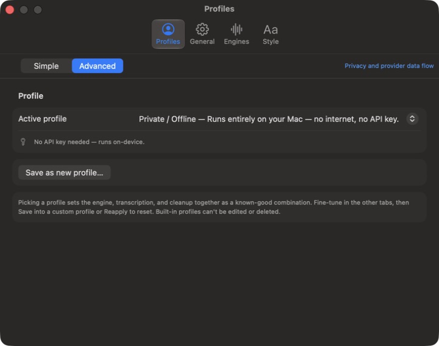

# Talkie

Talkie is a native macOS menu-bar app that turns speech into text at the cursor with hold-to-talk, hands-free, local, batch-cloud, and instant-streaming workflows.




## Requirements

- macOS 14 or later.
- Apple Silicon is the supported and tested target.
- Microphone access is required to record. Accessibility access is required for global shortcuts and direct insertion into other apps; without insertion access, Talkie can fall back to the clipboard where the workflow permits it.
- Talkie is a menu-bar app and hides its Dock icon by default.

The project does not currently publish or validate an Intel release. The app has no project-level Intel exclusion, but its pinned FluidAudio/Parakeet implementation explicitly requires Apple Silicon for on-device transcription. Treat Intel, including cloud-only use, as unsupported until it has been built and exercised on Intel hardware.

## Install

### 1. Notarized release — supported standard, not yet published

A Developer ID-signed and Apple-notarized build is the only supported public binary standard, but none is published today. When one becomes available, it will be listed on [GitHub Releases](https://github.com/b1rd33/talkie/releases). Do not assume an asset is notarized unless its release notes say so.

### 2. Build from source

Install Xcode and [XcodeGen](https://github.com/yonaskolb/XcodeGen), then:

```bash
brew install xcodegen
xcodegen generate
xcodebuild -project Talkie.xcodeproj -scheme Talkie -configuration Debug build
```

Launch the built app from Xcode or the build products directory, then follow onboarding for Microphone and Accessibility access. Cloud workflows use provider API keys stored in the macOS Keychain; the Private / Offline profile needs no key.

### 3. Ad-hoc community preview — advanced and unsupported

The published [v1.0.0 release](https://github.com/b1rd33/talkie/releases/tag/v1.0.0) contains an ad-hoc-signed, non-notarized community preview. It requires a manual Gatekeeper override, has no automatic updater, may lose its Accessibility grant after replacement, and is not the supported installation path. See the [community-preview installation guide](docs/install-free.md) before using it.

## Core workflows

### Dictate

- Hold `fn`, speak, and release to transcribe and insert at the captured target.
- Double-tap `fn` to start hands-free recording; double-tap again to finish.
- Press Escape while a dictation is active to cancel.
- Reuse the last dictation with `⇧⌥V`. Custom push-to-talk and hands-free shortcuts are available in Settings.

### Choose an engine

| Engine | Behavior | Requirements |
| --- | --- | --- |
| Cloud batch | Records locally, then sends audio after release to the selected OpenAI or OpenRouter transcription service. | The selected provider's API key |
| Instant | Streams audio to OpenAI while recording. It supports live preview, optional raw live typing, and optional skip-cleanup insertion. | OpenAI API key; Accessibility for live typing |
| On this Mac | Transcribes with FluidAudio/Parakeet without sending dictated audio to a transcription provider. | Apple Silicon and downloaded local models; the current Talkie local workflow is English-only |

Talkie fails closed when a local profile is selected but its models are missing; it does not silently switch that profile to cloud transcription.

### Shape the result

- **Profiles** apply a coherent engine, provider, model, and cleanup pipeline. Built-in profiles include Private / Offline, Live Typing, Instant, Best Accuracy, and Cheapest Cloud; custom profiles can preserve tuned settings.
- **Cleanup** ranges from raw text through punctuation, filler removal, self-correction/list handling, or custom instructions. Cleanup is a cloud operation unless it is disabled.
- **Snippets** replace spoken trigger phrases with exact local expansions.
- **Dictionary** entries improve provider prompts and cleanup; the local Parakeet path does not provide ASR-level dictionary biasing.
- **Nearby context** is opt-in and reads only a bounded portion of the focused editable field for smart insertion. Secure/password fields are excluded.
- **Selected-text transforms** send the selected text and an explicit instruction to the configured cleanup provider.
- **Language and microphone selection** let you pin an output language and choose an input device. Provider language coverage varies; the current local workflow is English-only.

### Review and personalize

- **History** is stored locally and supports search, reuse, and per-dictation details. Audio retention is configurable; deletion after successful dictation is best-effort.
- **Pill styles** include Bare Waveform, Ink Line, Calm Flow Ribbon, Bare Wave, Dynamic Island, Frosted Glass, and Hidden. The organic styles use live audio levels and respect Reduce Motion.
- **Per-app style** can choose a cleanup tone for different applications without storing nearby context.

## Data flow

Talkie has no account system, analytics, advertising, or Talkie-operated server. Cloud features connect directly from the Mac to the configured provider with the user's key. See [PRIVACY.md](PRIVACY.md) for retention caveats, provider policies, local storage, and the complete feature-by-feature data flow.

| Destination | When contacted | Data that may leave the Mac |
| --- | --- | --- |
| OpenAI | Direct batch transcription when selected; all instant transcription; cleanup or selected-text transforms when selected | Recorded or streaming audio and transcription hints; or transcript/selected text, instructions, dictionary/style/language guidance, and optional nearby context |
| OpenRouter | Batch transcription, cleanup, or selected-text transforms when selected; credit lookup from Home when a key is saved | Recorded audio and transcription settings; or transcript/selected text, instructions, optional nearby context; or an authenticated credits request. OpenRouter may route model requests onward. |
| Hugging Face | Downloading the FluidAudio/Parakeet model | Model download requests and ordinary network metadata; not dictated audio, transcripts, or nearby context |
| No provider | Private / Offline profile with cleanup disabled | Dictated audio and transcript processing stay on the Mac; local history and retained recordings remain local |

API keys are stored in the macOS Keychain. Talkie is intentionally not sandboxed because direct insertion depends on macOS Accessibility APIs.

## Build, test, and contribute

Generate the project before building because `project.yml` is the source of truth:

```bash
xcodegen generate
xcodebuild -project Talkie.xcodeproj -scheme Talkie -configuration Debug build
```

Run the deterministic macOS suite:

```bash
xcodebuild test \
  -project Talkie.xcodeproj \
  -scheme Talkie \
  -destination 'platform=macOS'
```

Project configuration checks are available at `scripts/verify-project-config.sh`; documentation checks are at `scripts/verify-docs.sh`. Host insertion and credentialed provider checks are separate, explicit workflows documented in [the testing matrix](docs/testing-matrix.md).

Maintainers use `scripts/release.sh` for the fail-closed Developer ID and Apple
notarization pipeline. Local signing/notary environment setup, the
`--validate-environment` preflight, artifact checksums, and the separate
unsupported community-preview path are documented in the
[installation guide](docs/install-free.md). The release script never creates a
tag, pushes, or publishes an asset.

- [Contributing guide](CONTRIBUTING.md)
- [Security policy](SECURITY.md)
- [Support](SUPPORT.md)
- [Code of Conduct](CODE_OF_CONDUCT.md)
- [Changelog](CHANGELOG.md)
- [Apache License 2.0](LICENSE), [NOTICE](NOTICE), and [third-party notices](THIRD_PARTY_NOTICES.txt)

## Project status and known limitations

Talkie is an early public project. Version 1.0.0 was published on 2026-06-15 as an ad-hoc macOS community preview. A Developer ID-signed and Apple-notarized distribution is the supported public standard but is not currently available.

- Apple Silicon is the only supported/tested hardware target. Intel releases and Intel cloud-only behavior are not validated.
- The on-device model requires Apple Silicon, is currently presented by Talkie as English-only, and requires a separate model download of about 2 GB.
- Cloud transcription, cleanup, and transforms require the user's provider key and are billed under that provider's current terms. Talkie does not promise provider pricing, availability, latency, or retention behavior.
- Instant mode is OpenAI-only. Live typing inserts raw streamed text and therefore disables a later cleanup pass.
- Private transcription does not imply private cleanup: use the Private / Offline profile, or separately disable cleanup, to keep transcript processing local.
- Talkie attempts to delete temporary audio after a successfully completed dictation, but deletion is best-effort. Failed, cancelled, or deletion-error cases can leave an audio file on the Mac for retry or recovery.
- Direct insertion depends on Accessibility and intentionally refuses secure/password fields. The non-notarized ad-hoc build can require permission repair after an update.
- There is no automatic updater for the current ad-hoc community preview.
